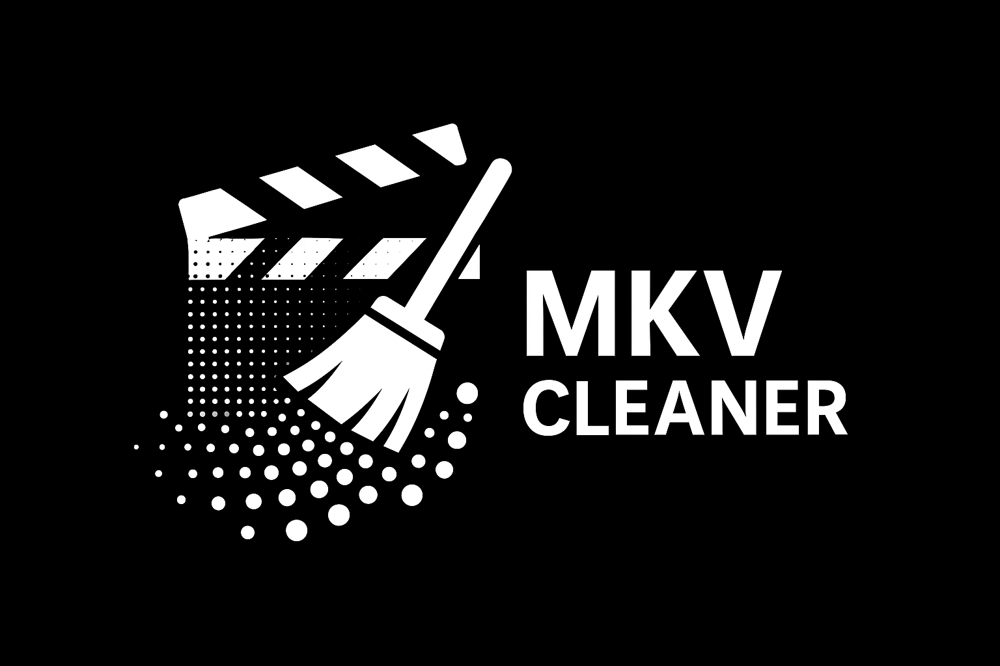

# MKV Cleaner

MKV Cleaner is an easy-to-use GUI for tidying Matroska (`.mkv`) files. You can quickly remove unwanted audio or subtitle tracks, choose which track should be default or forced and even process many files at once.

## Key Features

- **Batch processing** – clean groups of files with the same track layout all at once
- **Drop unneeded tracks** – remove audio or subtitle tracks you don't want
- **Control default and forced flags** for audio and subtitle tracks
- *Faded flag icons show the original default/forced state from the file*
- **Subtitle preview** lets you inspect text before processing
- **Flexible backend** – work with either MKVToolNix or FFmpeg (FFmpeg is the default)
- **Self-contained bundles** ship with all required dependencies

## Dependencies

When running from source the application will try to download missing command
line tools and install Python packages automatically. You only need to ensure
`pip` can install packages. The following tools are used:

- [Python 3.10 or later](https://www.python.org/downloads/)
- [PySide6](https://pypi.org/project/PySide6/)
- [tomli](https://pypi.org/project/tomli/) *(for Python < 3.11)*
- [MKVToolNix](https://mkvtoolnix.download/) (`mkvmerge` and `mkvextract` on your `PATH`) *(optional if using FFmpeg)*
- [FFmpeg](https://ffmpeg.org/) (`ffmpeg` and `ffprobe` on your `PATH` if selected)

Missing binaries (`mkvmerge`, `mkvextract`, `ffmpeg`, `ffprobe`) will be
downloaded to the application directory on first launch if they cannot be
found, and Python packages will be installed automatically.

The prebuilt bundles published in the GitHub releases already include PySide6
and FFmpeg so no additional installation is required. Copies of their licenses
are distributed alongside the bundle.

## Installation

Install MKV Cleaner with `pip` after cloning the repository:

```bash
pip install .
```

For development you can use an editable install:

```bash
pip install -e .
```

## Usage

1. Install the dependencies above.

2. On Windows, simply double-click `mkv_cleaner.py` to launch the program. If you prefer the command line, run:

   ```bash
   python mkv_cleaner.py
   ```
3. Click **Open Files** to select one or more MKV files.
4. For each group of files with the same track layout you can:
    - uncheck tracks you wish to remove
    - set a default audio or subtitle track
    - toggle the forced subtitle flag
    - preview subtitle text
    - wipe all subtitles if desired
    - the status bar shows which track became default or forced
5. Use **Process Group** or **Process All** to create cleaned files in the output directory (by default `cleaned/`).

Paths to the command line tools, the output directory and the preferred backend (MKVToolNix or FFmpeg) can be configured via the Preferences dialog (⚙️ icon).

## Testing

Run the unit tests with:

```bash
pytest
```

Set the environment variable `MKVCLEANER_SKIP_BOOTSTRAP=1` to disable
automatic downloads and package installation when running tests or
using the application in offline environments.


## License

This project is licensed under the [MIT License](LICENSE).

